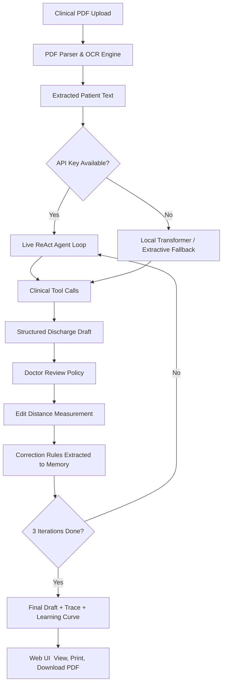

# ClinicalAI — Discharge Summary Agent

An intelligent clinical AI system that reads patient records, audits medications, flags safety concerns, and generates structured discharge summaries  learning and improving from every clinician correction.

---

## What It Does

When a patient is discharged from hospital, a clinician needs to produce a detailed summary covering diagnosis, medications, follow-up instructions, and any pending results. This is time-consuming and error-prone. ClinicalAI automates this with a **ReAct (Reasoning and Acting)** agent loop that:

1. **Reads** raw PDF clinical records  including scanned/image-only documents via OCR
2. **Audits** medications, pending lab results, and diagnostic trends using dedicated clinical tools
3. **Flags** safety concerns (medication mismatches, missing data, conflicting diagnoses)
4. **Drafts** a structured, schema-validated discharge summary with zero fabrication
5. **Learns** from clinician corrections across 3 iterations, reducing edit distance to zero

A full-featured **web interface** lets clinical staff upload PDFs, monitor agent execution in real time, view/print discharge summaries, and track the learning curve  all in a clean hospital-themed UI.

---

## System Architecture



---

## Agent Loop & Clinical Tools

The agent runs a bounded **ReAct loop** (max 10 steps for live API, configurable for local mode) where each step produces:
`reasoning` → `action_chosen` → `result` → `next_decision`

**Available Tools:**

| Tool | What it does |
|---|---|
| `MedicationReconciliation` | Cross-checks admission medications against discharge prescriptions and flags omissions |
| `PendingResultsCheck` | Identifies outstanding lab results (cultures, panels) that haven't returned at discharge |
| `DiagnosticCheck` | Tracks and verifies stability metrics (e.g. creatinine trends, sodium levels) |
| `FlagContradiction` | Registers a typed clinical safety flag in the final draft |

The full reasoning trace is saved as a JSON file for clinical compliance review.

**Error resilience:**
- API errors (401, 429, timeout) are shown **once** per session — no repeated noise in the logs
- API keys are **redacted** from all error messages (`sk-***REDACTED***`) to prevent accidental exposure
- If a live API call fails, the system automatically falls back to a local Transformer pipeline, then to a deterministic extractive loop — ensuring a draft is always produced

---

## No-Fabrication Guarantee

The agent enforces a strict **zero-fabrication policy**:

- All draft fields default to `"missing"` or `"undocumented"`  the LLM cannot invent facts
- Output is validated against rigid Pydantic schemas (`DischargeSummaryDraft`, `ClinicalFlag`)
- Missing items are surfaced explicitly in `clinical_safety_flags` rather than omitted or guessed

---

## Clinician Feedback Learning Loop

After each draft, a simulated doctor review applies consistent formatting policies. The system then:

- Measures **Normalized Levenshtein Edit Distance** (0 = perfect, 1 = completely different) on critical fields
- Extracts the edit patterns as structured **correction rules**
- Injects those rules into the agent's prompt for the next iteration

**Sample results from the included patient records:**

| Patient | Iteration 1 (Baseline) | Iteration 2 (Feedback-Injected) | Iteration 3 (Aligned) |
|---|---|---|---|
| Prema J | 0.3854 | 0.0000 | 0.0000 |
| H D Nagaraja | 0.4116 | 0.0000 | 0.0000 |

By iteration 2, the agent learns the clinician's style policy and produces a draft requiring zero further corrections.

---

## Web Interface

The project ships with a complete hospital-themed web UI served by the FastAPI backend.

**Pages:**
-  **Home**  Live dashboard with patient count, agent steps run, flags detected, and best learning score
-  **Upload Records**  Drag-and-drop PDF upload, API key configuration, real-time processing status panel
-  **Agent Monitor**  Step-by-step live timeline of the ReAct agent's reasoning and tool calls
-  **Discharge Drafts**  Rendered clinical discharge document with print and PDF export
-  **Learning & Feedback**  Iteration cards, learning curve chart, and extracted correction rules
-  **Trace Explorer**  Full JSON trace viewer with search and tool-type filtering

---

## Setup & Installation

### 1. Install Dependencies

```bash
pip install -r requirements.txt
```

> **Note on heavy dependencies:** `torch`, `transformers`, and `easyocr` are large packages needed only for the local/offline processing path. If you always use a cloud API key (OpenAI, Gemini, etc.), these are still required to be installed but won't be loaded at runtime.

### 2. Configure Your API Key

Copy the example environment file and add your key:

```bash
cp .env.example .env
```

Then edit `.env`:

```env
LLM_API_KEY=your_api_key_here
```

The system **auto-detects the provider** from the key prefix  no other config needed:

| Key prefix | Provider | Default model |
|---|---|---|
| `sk-` | OpenAI | `gpt-4o` |
| `sk-ant-` | Anthropic | `claude-3-5-sonnet` |
| `gsk_` | Groq | `llama3-8b-8192` |
| `AIzaSy...` | Google Gemini | `gemini-2.5-flash` |
| `sk-or-` | OpenRouter | `llama-3.1-8b-instruct:free` |

If no key is provided, the system falls back to a **local Transformers pipeline**. You can also set the key at runtime via the **web UI** on the Upload page — no restart needed.

### Advanced environment options

```env
# Control how many steps the local ReAct loop runs (default: 5)
LOCAL_REACT_MAX_STEPS=5

# Force local mode regardless of API key
LLM_PROVIDER=local_transformers

# Override the default model for your provider
LLM_MODEL_NAME=gemini-2.5-flash
```

### 3. OCR for Scanned PDFs (Optional)

If your PDFs are image-only (scanned paper records), install the native Tesseract OCR engine:

- **Windows:** Download from [github.com/UB-Mannheim/tesseract](https://github.com/UB-Mannheim/tesseract/wiki) and install to `C:\Program Files\Tesseract-OCR\`

Then add to `.env`:

```env
ENABLE_LOCAL_OCR=true
TESSERACT_CMD=C:\Program Files\Tesseract-OCR\tesseract.exe
```

For PDFs that need page rendering before OCR, install [Poppler for Windows](https://github.com/oschwartz10612/poppler-windows/releases) and set:

```env
POPPLER_PATH=C:\poppler\Library\bin
```

### 4. Run the Web Server

```bash
python -m uvicorn server:app --host 0.0.0.0 --port 8000 --reload
```

Then open **http://localhost:8000** in your browser. That's it  the web interface handles everything from here.

### 5. Run from the Command Line (Alternative)

If you prefer to run without the web UI:

```bash
python main.py
```

Or pass the API key directly:

```bash
python main.py --api-key "your_api_key_here"
```

Output files are saved to:
- `output/drafts/`  Final discharge summary JSON per patient
- `output/traces/`  Full ReAct reasoning trace JSON per patient
- `output/plots/`  Learning curve PNG chart

---

## Project Structure

```
Clinical-Discharge-Summary-Agent/
 server.py              # FastAPI backend  serves web UI and all API endpoints
 main.py                # CLI orchestrator  runs the pipeline without the web server
 requirements.txt       # Python dependencies
 .env.example           # Template for environment configuration

 src/
    agent_loop.py      # Core ReAct agent  LLM calls, tool execution, draft compilation
    parser.py          # PDF text extraction with multi-engine OCR fallback chain
    doctor_sim.py      # Simulated clinician reviewer applying a hidden edit policy
    learning_engine.py # Edit distance tracking, rule extraction, learning curve plotting
    models.py          # Pydantic schemas for all structured data

 config/
    settings.py        # LLM provider auto-detection, agent step limits, timeouts

 web/
    index.html         # Single-page app markup
    style.css          # Light hospital-themed design system
    app.js             # Frontend logic  API calls, rendering, processing status

 data/
    raw_patients/      # Place your clinical PDF files here

 output/
     drafts/            # Generated discharge summary JSON files
     traces/            # Agent execution trace JSON files
     plots/             # Learning curve chart images
```

---

## Known Limitations

- **Prompt window bounds:** Correction rules are stored in the model's context window. This works well for tens of rules but won't scale to hundreds of institutional formatting policies without a vector database.
- **Metric gaming risk:** Optimising strictly for Levenshtein edit distance could cause the agent to match surface style patterns rather than ensuring full clinical completeness. Combine with human review.
- **Cold start:** The agent has no knowledge of a specific clinician's style on the first run  edit friction will be higher in iteration 1.
- **Free API tier limits:** With a free Gemini or Groq key, token quotas may be hit on large PDFs. The system gracefully falls back to local mode if this happens.

---

## What Could Be Added Next

- **RAG-based policy retrieval**  Store correction rules in a vector database so the agent can semantically search for relevant formatting instructions per department or specialty
- **LoRA fine-tuning**  Periodically train a small open-source model on approved doctor edits to bake style rules into the weights, removing prompt-size constraints
- **Multi-agent consensus**  Add a secondary "Reviewer Agent" that audits the draft against safety flags before presenting it to the clinician, reducing baseline friction
- **Real-time SSE streaming**  Stream agent step-by-step updates from the server to the browser for true live progress instead of the timed message simulation
