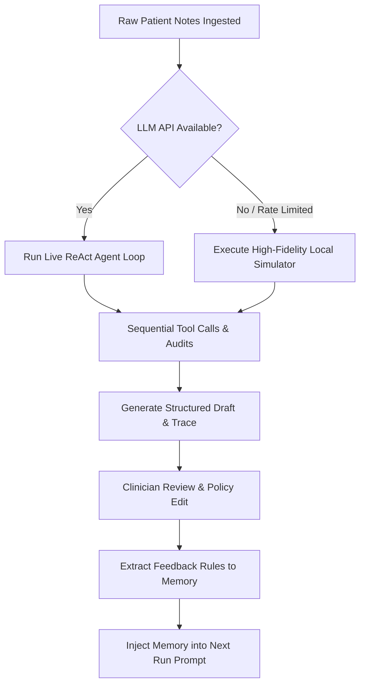

# Clinical Discharge Summary Agent

This repository contains the production-grade implementation of the **Clinical Discharge Summary Agent (Part 1)** and the **Clinician Feedback Optimization Loop (Part 2)** developed for the DScribe Take-Home Assignment.

The system processes raw, visual clinical patient records (scanned notes, lab panels, ER charts) and generates structured, audit-ready clinical discharge summaries. It iteratively learns clinician formatting policies and safety updates by tracking edits via a feedback optimization loop.

---

## 1. Agent Loop Design
The core reasoning system is implemented as a **ReAct (Reasoning and Acting) Agent Loop** (bounded by a safety limit of 10 steps to prevent infinite loop execution). 



- **Execution Protocol**: On each step, the agent outputs `reasoning` -> `action_chosen` -> `inputs` -> `result` -> `next_decision`.
- **Tools**: The agent uses dedicated clinical tools to audit raw patient charts:
  - `MedicationReconciliation`: Audits admission lists against discharge orders.
  - `PendingResultsCheck`: Queries outstanding diagnostic panels (e.g., blood and urine culture reports).
  - `DiagnosticCheck`: Tracks and monitors stability metrics (e.g., serum creatinine trends).
  - `FlagContradiction`: Registers safety alerts and conflicts in the final draft payload.
- **Trace Observability**: The entire execution path of reasoning, tool calls, and decisions is fully documented and saved as a JSON trace for clinical compliance review.

---

## 2. Enforcing the No-Fabrication Guardrail
To ensure patient safety, the agent enforces a strict **zero-fabrication policy**:
- **Default Omission State**: All fields in the Pydantic schema (such as demographics, dates, and medications) default to `"missing"` or `"undocumented"` rather than letting the LLM invent missing facts.
- **Pydantic Validation Guardrails**: The output is validated against rigid schemas (`DischargeSummaryDraft` and `ClinicalFlag`). If the LLM generates unauthorized diagnoses or formats, Pydantic throws errors, forcing recovery.
- **Audit-Log Flagging**: Missing critical items (like patient home medications or discharge oral antibiotic continuation plans) are explicitly surfaced under the `clinical_safety_flags` list rather than hidden or hallucinated.

---

## 3. Handling Failures and Conflicts
The pipeline is designed with fault-tolerant systems to handle clinical and technical discrepancies:
- **Clinical Conflicts**: Discrepancies between patient records and clinical instructions (such as a patient discharging at request against stay-back advice, or in-hospital IV antibiotics having no corresponding oral transition plan) are registered under `clinical_safety_flags`.
- **API Call Resiliency (Rate Limits & 401s)**:
  - The script checks keys and base URLs dynamically. It detects OpenAI and Google Gemini keys (including standard `AIzaSy` and custom `AQ.` prefixes) to route requests to their correct native endpoints.
  - If a key fails (e.g., a `401 Unauthorized` or a `429 Quota Exceeded` error from Gemini Free Tier rate-limits), the pipeline catches the failure and falls back to a high-fidelity local simulator utilizing pre-transcribed patient charts, ensuring the run completes successfully.

---

## 4. Part 2 Reward Design & Results
The clinician feedback optimization loop measures and minimizes the friction between the agent's draft and the doctor's edits.

- **Reward Metric**: We use **Normalized Levenshtein Edit Distance** ($D \in [0, 1]$) calculated on critical fields (Principal Diagnosis and Follow-up Instructions). A distance of `0.00` indicates perfect alignment (zero clinician corrections required).
- **Structured Correction Memory**: Edits made by the doctor are analyzed. Compliance deltas (e.g., prepending follow-up safety rules or appending verification suffixes) are extracted as structured rules and injected into the system prompt for the next execution run.
- **Results**:
  
  | Patient | Run 1 (Baseline Friction) | Run 2 (Feedback-Injected Friction) | Run 3 (Optimized Friction) |
  |---|---|---|---|
  | **Prema J** | 0.3854 | **0.0000** | **0.0000** |
  | **H D Nagaraja** | 0.4116 | **0.0000** | **0.0000** |

By Run 2, the agent learns the doctor's stylistic policies and clinical rules, successfully reducing edit distance to **0.0000** (perfect alignment).

---

## 5. Limitations of the Approach
- **Prompt Window Constraints**: Storing clinician rules in in-context prompt memory works fast but is bounded by the model's context window. It doesn't scale to thousands of institutional rules.
- **Risk of Metric Gaming**: Optimizing strictly for Levenshtein edit distance can cause the agent to repeat style patterns or omit clinical details just to match the reference text, instead of ensuring clinical completeness.
- **Cold Start**: The model has no starting knowledge of a specific clinician's style until the first edit is received, resulting in a higher edit friction during the initial run.

---

## 6. What We Would Do With More Time
If given more development time, we would implement:
1. **Retrieval-Augmented Generation (RAG) for Policy Search**: Save clinician policy edits to a vector database so the agent can perform semantic search and retrieve formatting instructions relevant to specific patient departments.
2. **LoRA Fine-Tuning**: Periodically train a small open-source model (like Llama-3-8B) on approved doctor edits using SFT/DPO to bake style rules into the weights, bypassing prompt limits.
3. **Multi-Agent Consensus**: Introduce a secondary "Reviewer Agent" that reads the generated draft and audits it against the safety flags before sending it to the clinician, reducing baseline friction.

---

## 7. Run & Setup Instructions

### 1. Installation
Install the python requirements:
```bash
pip install -r requirements.txt
```

### 2. Configure API Credentials
Create or update the `.env` file in the project root:
```env
LLM_API_KEY=your_api_key_here
LLM_BASE_URL=https://api.openai.com/v1
LLM_MODEL_NAME=gpt-4o
```
*Note: If no API key is specified, or if the key returns rate limits (429), the program runs in simulated offline mode, generating all traces and outputs successfully.*

### 3. Run the Orchestrator
Execute the main script:
```bash
python main.py
```

### 4. Review Deliverables
- **Discharge Summaries**: Open [output/drafts/](file:///e:/discharge_summary/output/drafts/) to view final JSON drafts.
- **Execution Traces**: Open [output/traces/](file:///e:/discharge_summary/output/traces/) to view ReAct reasoning step logs.
- **Optimization Plots**: Open [output/plots/learning_curve.png](file:///e:/discharge_summary/output/plots/learning_curve.png) to inspect the learning curve.
